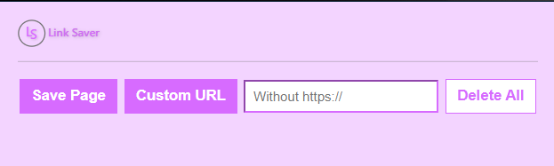
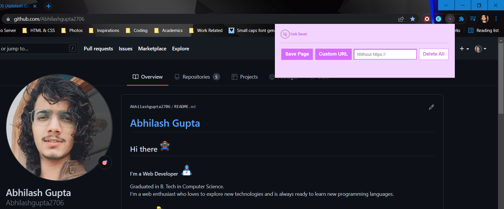

# Link Saver

### How to Use
This is not available on Google Extention Store. So you have to install it manually 😊
* Go to Open Chorme > Settings > Extentions, It will open another tab name "Extentions".
* Now on the navbar there will be an option named **"Load unpacked"**, It will oen your file explore.
* Select the path where you have downloaded this file.
* You have successfully installed Link Saver Extension to your chrome.

### Preview

### About this project
I made this project when I started of learning ***Web Development***. I made this project after completing my course from ***Scriba***. It helped me to understand JavaScript more clearly.

### About me
You can visit my [Portfolio Website](https://abhilash-gupta.web.app/) to know more about me 🤗
